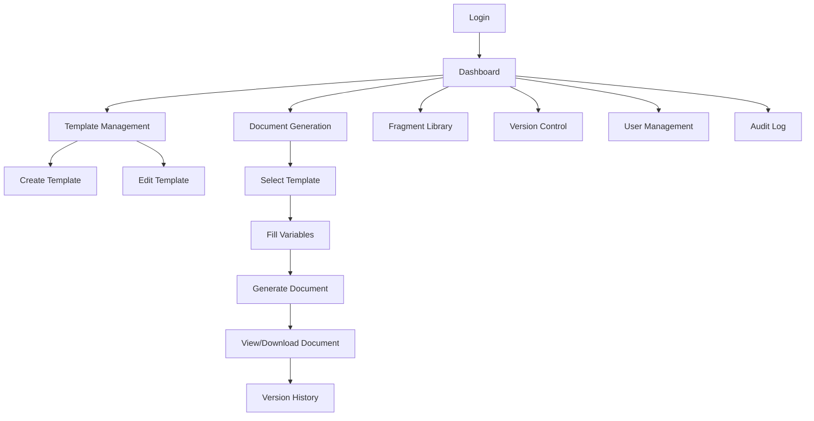

## 1. Product Overview
企业级文档生成平台，为企业提供模板管理、文档生成、版本控制等核心功能
- 解决企业文档标准化、自动化生成的问题，提高文档制作效率和一致性
- 目标用户为企业内部员工，特别是需要频繁制作标准化文档的部门
- 市场价值在于降低文档制作成本，提高企业运营效率

## 2. Core Features

### 2.1 User Roles
| Role | Registration Method | Core Permissions |
|------|---------------------|------------------|
| Admin | System assigned | Full access to all features, including user management |
| Editor | Admin invitation | Create, edit, and manage templates and documents |
| Viewer | Admin invitation | View and download generated documents |

### 2.2 Feature Module
1. **Template Management**: Create, edit, upload, and manage document templates
2. **Document Generation**: Generate documents from templates with dynamic data
3. **Version Control**: Track document and template versions, compare changes
4. **Fragment Library**: Manage reusable document fragments
5. **User Management**: Manage user roles and permissions
6. **Audit Log**: Track system activities and changes

### 2.3 Page Details
| Page Name | Module Name | Feature description |
|-----------|-------------|---------------------|
| Template Management | Template List | Display all templates, support search and filter |
| Template Management | Template Editor | Upload DOCX files, define variables, preview template |
| Document Generation | Generate Form | Fill in template variables, preview generated document |
| Document Generation | Document List | Display generated documents, support search and filter |
| Version Control | Version History | View all versions of a document/template, compare differences |
| Fragment Library | Fragment List | Display all fragments, support search and categorization |
| Fragment Library | Fragment Editor | Create and edit reusable document fragments |
| User Management | User List | Manage users, assign roles and permissions |
| Audit Log | Activity Log | View system activities, filter by user and action |

## 3. Core Process
### Main User Flow
1. Admin creates and manages templates
2. Editor fills in template variables to generate documents
3. System processes the template with provided data
4. Generated documents are stored with version history
5. Users can view, download, and compare document versions

## 4. User Interface Design
### 4.1 Design Style
- Primary color: #3498db (blue)
- Secondary color: #2ecc71 (green)
- Button style: Rounded corners, subtle shadow
- Font: System UI, 14px base size
- Layout style: Side navigation, card-based content
- Icon style: Minimal, line-based icons

### 4.2 Page Design Overview
| Page Name | Module Name | UI Elements |
|-----------|-------------|-------------|
| Dashboard | Overview | Card-based metrics, recent activities, quick access buttons |
| Template Management | Template List | Table with template name, creation date, last modified, actions |
| Template Management | Template Editor | File upload area, variable definition form, preview pane |
| Document Generation | Generate Form | Template selector, form fields for variables, preview button |
| Document Generation | Document List | Table with document name, generation date, template used, actions |
| Version Control | Version History | Timeline view of versions, compare button, restore button |
| Fragment Library | Fragment List | Grid view of fragments, search bar, category filter |
| Fragment Library | Fragment Editor | Rich text editor, save and preview buttons |
| User Management | User List | Table with user name, role, email, status, actions |
| Audit Log | Activity Log | Table with timestamp, user, action, details, filter options |

### 4.3 Responsiveness
- Desktop-first design
- Mobile-adaptive layout
- Touch optimization for mobile devices
- Collapsible sidebar for smaller screens

### 4.4 3D Scene Guidance
Not applicable for this project