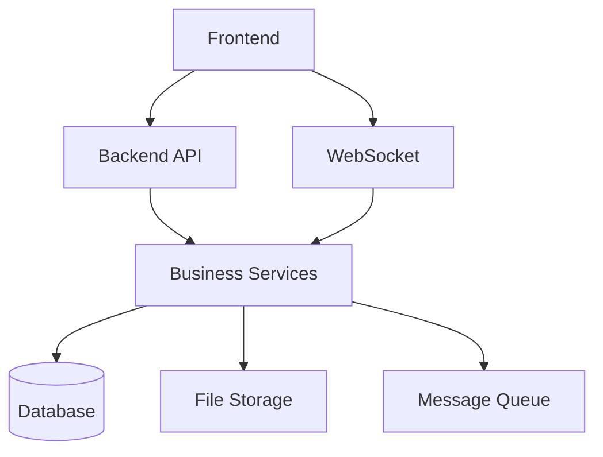
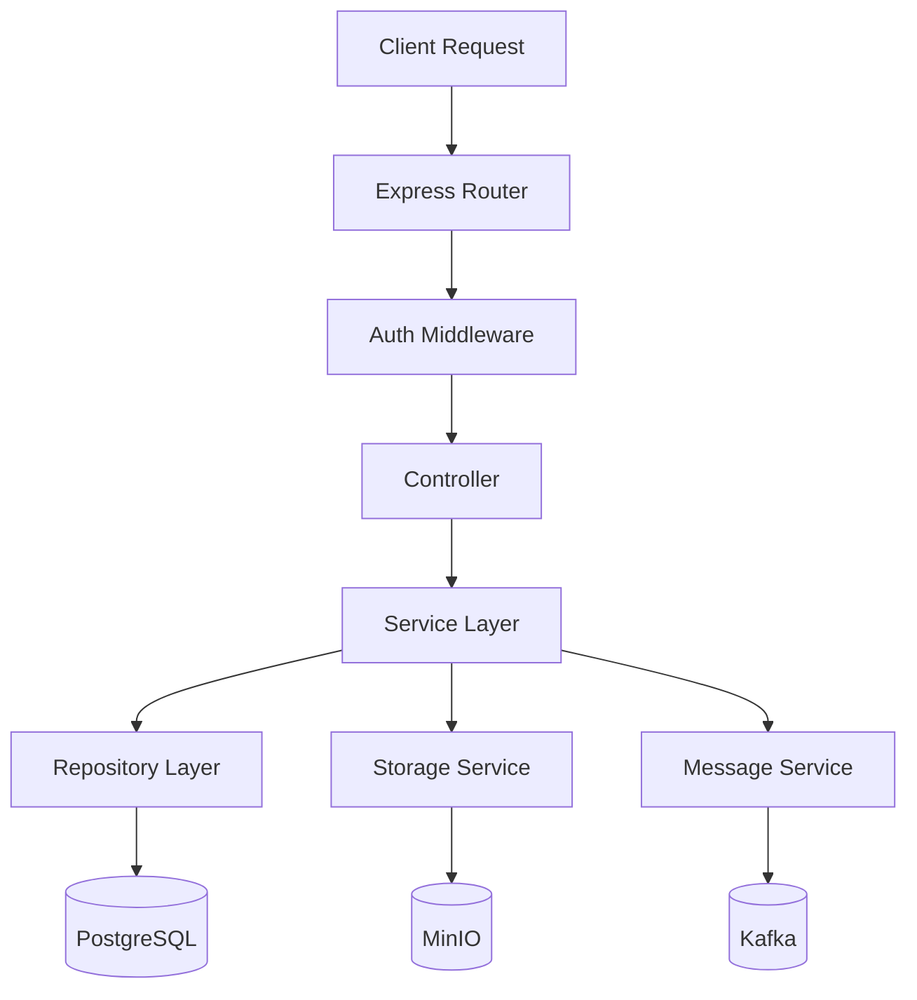
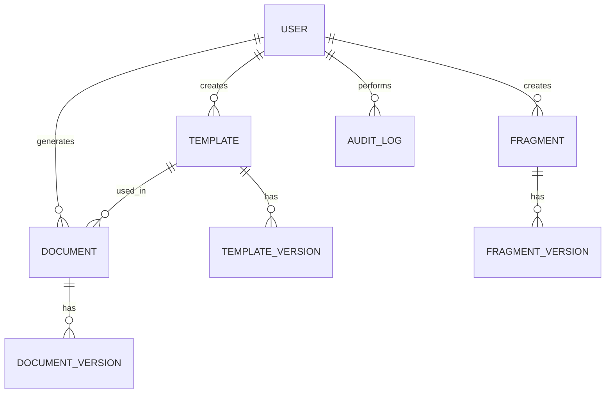

## 1. Architecture Design


## 2. Technology Description
- Frontend: Vue 3 + Vite + Element Plus + Pinia + vue-i18n
- Initialization Tool: Vite
- Backend: Node.js + Express.js
- Database: PostgreSQL
- File Storage: MinIO
- Message Queue: Kafka
- API Gateway: Kong
- Monitoring: Prometheus + Grafana

## 3. Route Definitions
| Route | Purpose |
|-------|---------|
| / | Login page |
| /dashboard | Main dashboard |
| /templates | Template management |
| /templates/create | Create new template |
| /templates/:id/edit | Edit template |
| /documents | Document generation and list |
| /documents/generate | Generate new document |
| /documents/:id | View document details |
| /fragments | Fragment library |
| /fragments/create | Create new fragment |
| /fragments/:id/edit | Edit fragment |
| /versions | Version control |
| /versions/:id/history | Version history for document/template |
| /users | User management |
| /users/create | Create new user |
| /users/:id/edit | Edit user |
| /audit | Audit log |

## 4. API Definitions
### 4.1 Authentication APIs
- `POST /api/auth/login`: User login
- `POST /api/auth/logout`: User logout
- `GET /api/auth/me`: Get current user info

### 4.2 Template APIs
- `GET /api/templates`: Get all templates
- `POST /api/templates`: Create new template
- `GET /api/templates/:id`: Get template details
- `PUT /api/templates/:id`: Update template
- `DELETE /api/templates/:id`: Delete template
- `POST /api/templates/:id/upload`: Upload template file

### 4.3 Document APIs
- `GET /api/documents`: Get all documents
- `POST /api/documents/generate`: Generate new document
- `GET /api/documents/:id`: Get document details
- `DELETE /api/documents/:id`: Delete document
- `GET /api/documents/:id/download`: Download document

### 4.4 Fragment APIs
- `GET /api/fragments`: Get all fragments
- `POST /api/fragments`: Create new fragment
- `GET /api/fragments/:id`: Get fragment details
- `PUT /api/fragments/:id`: Update fragment
- `DELETE /api/fragments/:id`: Delete fragment

### 4.5 Version APIs
- `GET /api/versions/:type/:id`: Get version history for template/document
- `GET /api/versions/:type/:id/:versionId`: Get specific version
- `POST /api/versions/:type/:id/compare`: Compare versions
- `POST /api/versions/:type/:id/restore`: Restore version

### 4.6 User APIs
- `GET /api/users`: Get all users
- `POST /api/users`: Create new user
- `GET /api/users/:id`: Get user details
- `PUT /api/users/:id`: Update user
- `DELETE /api/users/:id`: Delete user

### 4.7 Audit APIs
- `GET /api/audit`: Get audit logs
- `GET /api/audit/filter`: Filter audit logs

## 5. Server Architecture Diagram


## 6. Data Model
### 6.1 Data Model Definition


### 6.2 Data Definition Language
#### Users Table
```sql
CREATE TABLE users (
    id SERIAL PRIMARY KEY,
    name VARCHAR(255) NOT NULL,
    email VARCHAR(255) UNIQUE NOT NULL,
    password VARCHAR(255) NOT NULL,
    role VARCHAR(50) NOT NULL,
       status VARCHAR(50) NOT NULL,
    created_at TIMESTAMP DEFAULT CURRENT_TIMESTAMP,
    updated_at TIMESTAMP DEFAULT CURRENT_TIMESTAMP
);
```

#### Templates Table
```sql
CREATE TABLE templates (
    id SERIAL PRIMARY KEY,
    name VARCHAR(255) NOT NULL,
    description TEXT,
    file_path VARCHAR(512) NOT NULL,
    variables JSONB,
    created_by INTEGER REFERENCES users(id),
    created_at TIMESTAMP DEFAULT CURRENT_TIMESTAMP,
    updated_at TIMESTAMP DEFAULT CURRENT_TIMESTAMP
);
```

#### Documents Table
```sql
CREATE TABLE documents (
    id SERIAL PRIMARY KEY,
    name VARCHAR(255) NOT NULL,
    template_id INTEGER REFERENCES templates(id),
    data JSONB,
    file_path VARCHAR(512) NOT NULL,
    created_by INTEGER REFERENCES users(id),
    created_at TIMESTAMP DEFAULT CURRENT_TIMESTAMP,
    updated_at TIMESTAMP DEFAULT CURRENT_TIMESTAMP
);
```

#### Fragments Table
```sql
CREATE TABLE fragments (
    id SERIAL PRIMARY KEY,
    name VARCHAR(255) NOT NULL,
    content TEXT NOT NULL,
    category VARCHAR(255),
    created_by INTEGER REFERENCES users(id),
    created_at TIMESTAMP DEFAULT CURRENT_TIMESTAMP,
    updated_at TIMESTAMP DEFAULT CURRENT_TIMESTAMP
);
```

#### Versions Tables
```sql
CREATE TABLE template_versions (
    id SERIAL PRIMARY KEY,
    template_id INTEGER REFERENCES templates(id),
    version VARCHAR(50) NOT NULL,
    file_path VARCHAR(512) NOT NULL,
    variables JSONB,
    created_by INTEGER REFERENCES users(id),
    created_at TIMESTAMP DEFAULT CURRENT_TIMESTAMP
);

CREATE TABLE document_versions (
    id SERIAL PRIMARY KEY,
    document_id INTEGER REFERENCES documents(id),
    version VARCHAR(50) NOT NULL,
    file_path VARCHAR(512) NOT NULL,
    data JSONB,
    created_by INTEGER REFERENCES users(id),
    created_at TIMESTAMP DEFAULT CURRENT_TIMESTAMP
);

CREATE TABLE fragment_versions (
    id SERIAL PRIMARY KEY,
    fragment_id INTEGER REFERENCES fragments(id),
    version VARCHAR(50) NOT NULL,
    content TEXT NOT NULL,
    created_by INTEGER REFERENCES users(id),
    created_at TIMESTAMP DEFAULT CURRENT_TIMESTAMP
);
```

#### Audit Log Table
```sql
CREATE TABLE audit_logs (
    id SERIAL PRIMARY KEY,
    user_id INTEGER REFERENCES users(id),
    action VARCHAR(255) NOT NULL,
    resource_type VARCHAR(255) NOT NULL,
    resource_id INTEGER,
    details JSONB,
    ip_address VARCHAR(100),
    created_at TIMESTAMP DEFAULT CURRENT_TIMESTAMP
);
```